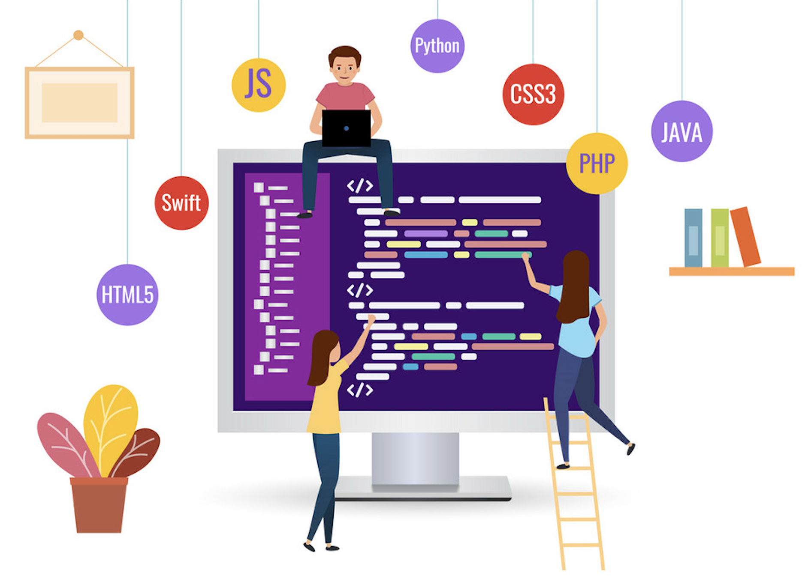
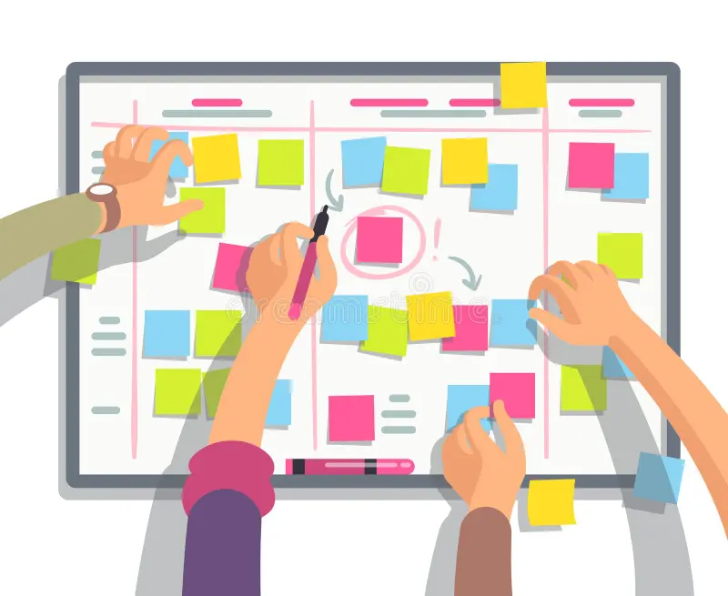

## My Journey in Software Engineering

As I approach the end of my ICS 314 Software Engineering class, I realize that the knowledge I've gained goes far beyond just developing web applications. While building web-based projects was a key part of our coursework, the main focus of this class was on understanding and applying essential software engineering principles. Concepts like Agile Project Management, Issue Driven Development, Configuration Management, and Ethics in Software Engineering initially seemed abstract to me. However, through hands-on experience and in-depth study, I now appreciate their critical importance and plan to utilize them in various future projects, regardless of the specific technology or domain.

## From Issues to Progress: A Journey with Agile Development

Throughout the final project, I adopted Agile Project Management, an approach that emphasizes flexibility, teamwork, and steady progress in the software development process. Unlike traditional project management, which often follows a strict, step-by-step plan, Agile enables teams to adjust to changes and continuously enhance their work through regular feedback and iterative cycles. Within Agile, Issue Driven Project Management is a specialized approach that focuses on identifying, prioritizing, and resolving issues as they arise throughout the project. This method ensures that projects stay on track with their objectives despite unexpected challenges. Organizing tasks and tracking them as issues on GitHub demonstrated to me how much clarity and focus a structured approach can bring to a project, making it easier to manage. 

Beyond web development, I can see myself applying Agile approaches to projects such as launching a marketing campaign, where strategies may need to shift quickly based on market responses or consumer feedback. The ability to adjust and react to changes promptly is essential in any project environment.

## Tracking Progress: The Importance of Configuration Management

At first, Git and GitHub seemed like simple tools for saving versions of my code, nothing more than a safety net in case something went wrong. However, as I worked on projects throughout the course, I realized Configuration Management is so much more. It’s about systematically handling changes to ensure consistency, reliability, and smooth collaboration. Git tracks every change, and GitHub provides a platform to organize tasks, track issues, and streamline teamwork, making projects clearer and more manageable. Features like branching and merging proved incredibly helpful. Working on individual branches allowed me to experiment freely without worrying about breaking the main codebase. Once I was satisfied with the results, merging my changes back into the main branch was seamless and rewarding. This structured approach not only simplified project organization but also improved collaboration with my teammates. 

Outside of software projects, I can see myself applying these Configuration Management practices to projects such as organizing a community event or collaborating on a group research paper. Tracking edits and managing contributions would significantly reduce errors and improve overall outcomes. Embracing Configuration Management has taught me the value of maintaining an organized and reliable framework, which is essential for the success of any complex project.

## Ethical Engineering: Designing with Responsibility in Mind

Ethics in Software Engineering is a fundamental concept that addresses the moral responsibilities of software developers in creating technology that positively impacts society. This includes considerations such as user privacy, data security, accessibility, and the societal implications of software applications. Understanding ethical principles ensures that as engineers, we make decisions that prioritize the well-being of users and the broader community. 

In future projects, whether they involve developing healthcare applications, educational tools, or any other software, adhering to ethical standards will guide me in creating responsible and trustworthy solutions. By integrating ethics into the software development process, I can contribute to building technologies that are not only functional and efficient but also fair, inclusive, and beneficial to society as a whole.

## From Abstract Ideas to Real-World Solutions: The Journey Continues

This Software Engineering course has significantly broadened my perspective on what it means to develop software effectively and responsibly. I’ve realized that being a successful engineer goes beyond just writing good code—it’s about being organized, collaborative, and responsible throughout every stage of the process. Through exploring Agile Project Management, Issue Driven Development, Configuration Management, and Ethics in Software Engineering, I have gained a deeper understanding of the foundational principles that drive successful software projects. 

These concepts which were initially abstract, have become essential tools that I will carry forward into my future endeavors, enabling me to create strong, reliable, and ethically responsible software solutions across various domains. As I move forward in my career, the lessons learned in this class will undoubtedly guide me in tackling diverse projects with confidence and integrity.

 
