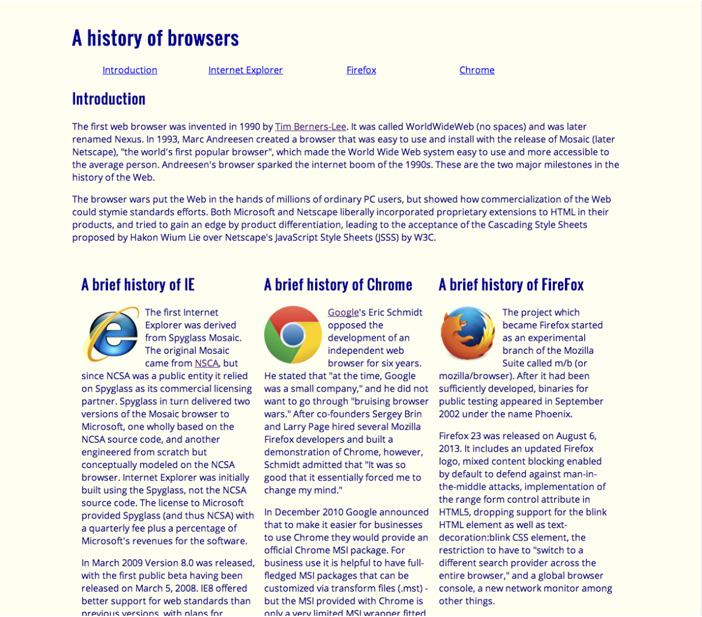
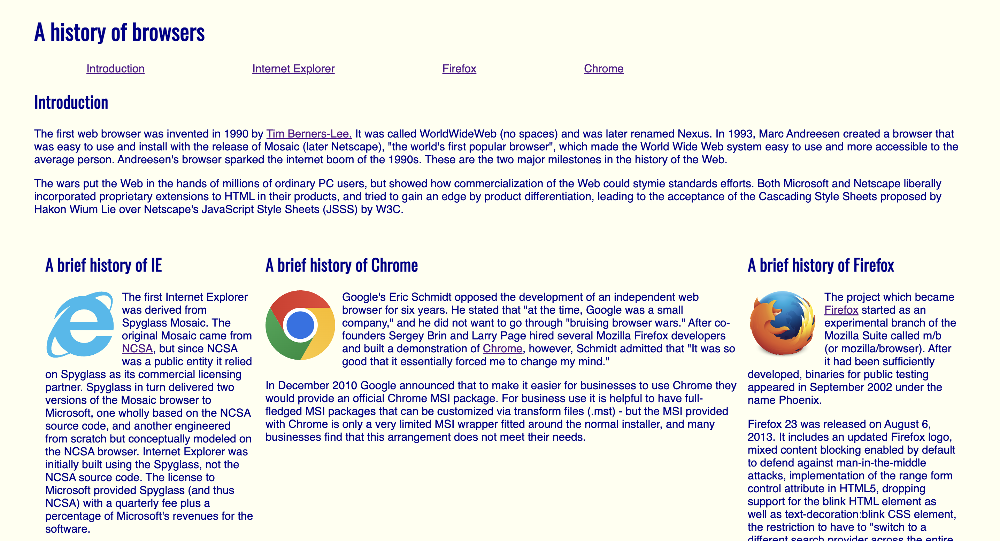
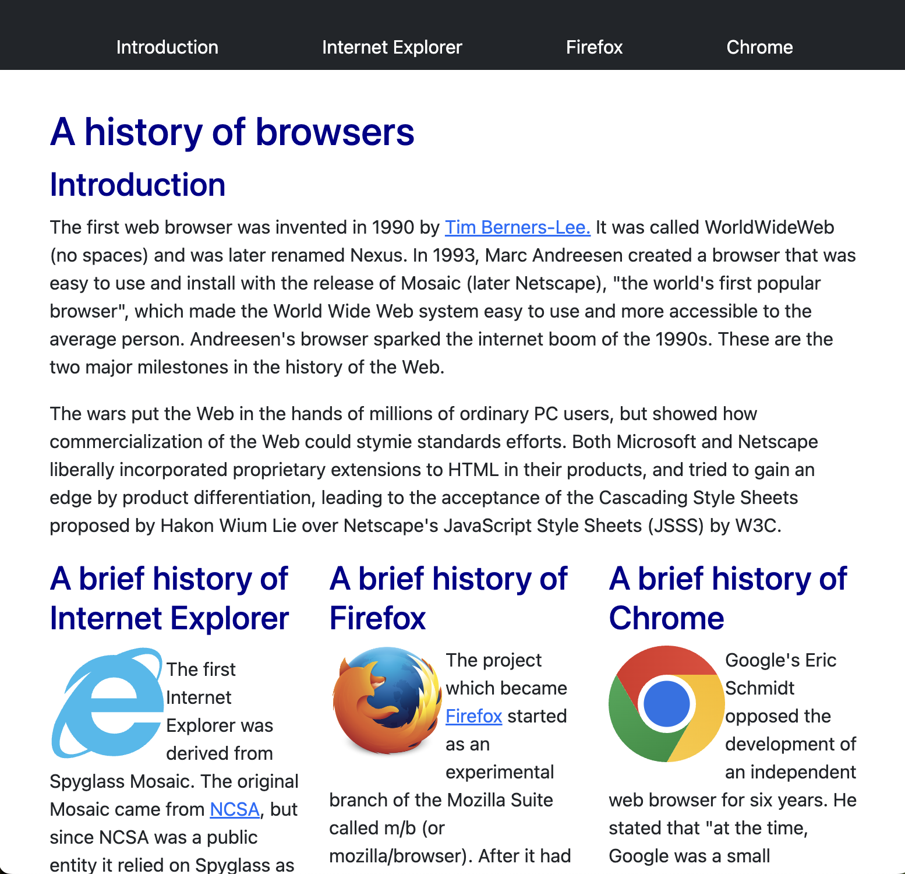
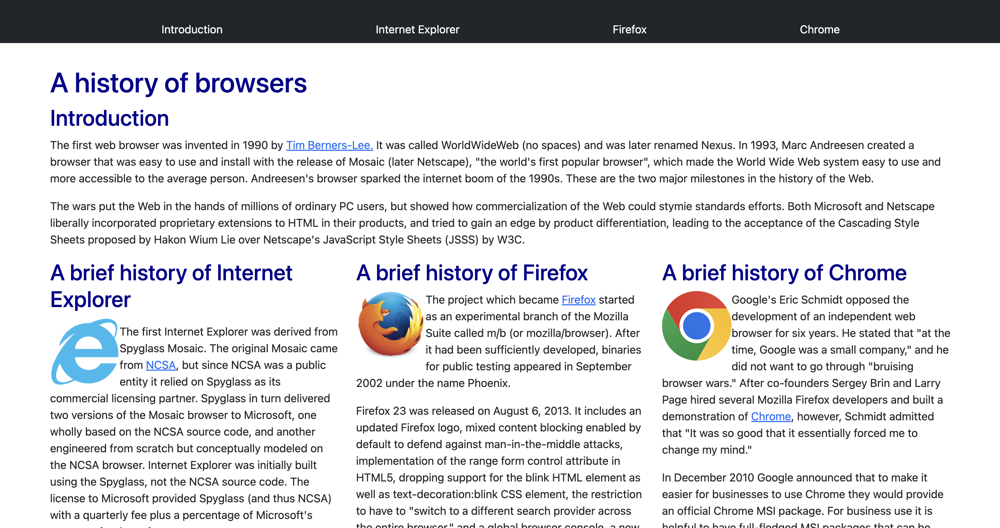

## What Makes a Website Engaging?
What kind of website makes you want to keep scrolling? Is it a simple, plain website or a well-detailed one? I definitely prefer well-detailed websites—who wants to stay on a boring site for long? When creating a website, design plays a crucial role in attracting users. Even if you have an outstanding product or content, a poorly designed website may prevent people from engaging with it.

## Starting with the Basics: Raw HTML and CSS
There are many ways to create a website. In my ICS 314 class, we began with raw HTML and CSS. HTML is like the skeleton of a webpage where you define the content, and CSS is where you decorate and style it. Using raw HTML and CSS, you can customize every detail of your website. When I first started using them, I didn’t think it was too bad, to be honest. They use a very straightforward language, so it helped me understand what was going on. However, I soon realized that using them can be very time-consuming, especially when things get more complex. On one hand, you have absolute control over your page. On the other hand, you have to create every element from scratch, which leads to longer code and extra work.

## Gaining New Experience: UI Frameworks 
Then, we began learning how to use User Interface (UI) frameworks like Bootstrap. These tools provide pre-made, reusable components and styling. At first, using them was very confusing to me. It felt like learning a new language, and I was frustrated when things didn’t turn out the way I wanted. I was used to keeping the structure (HTML) and styling (CSS) separate. But with UI frameworks, you can format elements directly in HTML using predefined classes. However, once I became more familiar with them, I started to understand why UI frameworks are so popular. The biggest advantage is their ready-to-use components, like buttons, navigation bars, and forms. Imagine creating these manually with raw HTML and CSS—that would be a lot of extra work.

## Simplifying Responsiveness with Bootstrap 5
As I gained more hands-on experience as a web developer, I realized the importance of website responsiveness. A website needs to adapt to different screen sizes, depending on the users’ devices, such as phones, tablets, or laptops. With raw HTML and CSS, I would have to write my own media queries to adjust the layout for each screen size, which requires a lot of work. However, Bootstrap makes it much easier to build responsive websites, as it includes a grid system that adjusts automatically. 

  

**Raw HTML and CSS** 

 

   

  

**Bootstrap 5**

 

  

  

The images on the left show what they look like in their default size. However, the images on the right illustrate what happens when the display is stretched. The column layout created with raw HTML and CSS becomes uneven, resulting in an awkward design. In contrast, the layout using Bootstrap stays consistent and well-structured due to its responsive design capabilities, which ensure that the columns remain properly aligned and maintain a neat appearance even when resized.

 

## UI Frameworks: A Developer’s Best Friend ##
Although the terminology in UI frameworks can be confusing at first, they are powerful tools that are worth learning. They streamline the process of creating visually appealing, responsive, and user-friendly interfaces. Why not take advantage of these cool tools, like UI frameworks, to make your development process more efficient and enjoyable? With frameworks like Bootstrap, you can focus more on building great features rather than worrying about every detail of styling from scratch.
