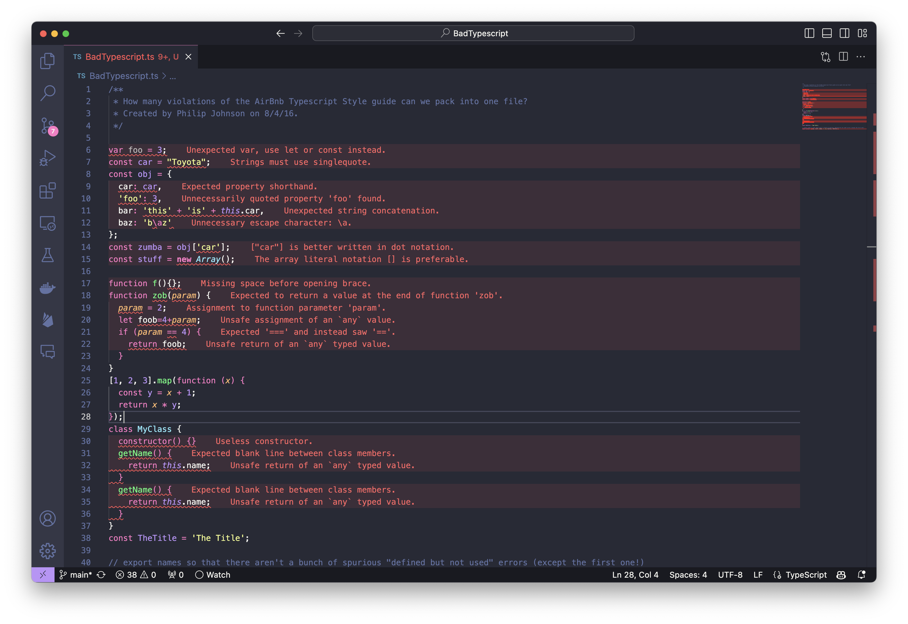

##  Is Organization Really Necessary?

Are you good at keeping things organized? For me, it depends. However, when it comes to schoolwork, I think I am. I like to keep my tabs, folders, and notes neat and well-organized. By doing so, I can find specific things easily whenever I need them, without wasting time searching. This boosts my productivity because I can quickly access everything I need and start working before I lose focus. I believe organization is just as important in coding because if the program is messy and unorganized, it becomes difficult to follow and understand its function at a glance.

## Coding Standards: The Key to Clean Code

When I took ICS 111, Introduction to Computer Science I, following coding standards and formatting code properly was a requirement and a graded component. Coding standards are guidelines that ensure code is written consistently, cleanly, and in a readable manner. These standards include elements like code formatting (indentation, line length, braces, line breaks, and spacing), as well as naming conventions and documentation. At first, I didn’t understand why my professor emphasized them so much, since I thought they were trivial and didn’t affect whether the program ran. However, as my code grew more complex, I realized the importance of these guidelines. Not only do they make the code more aesthetically pleasing, but they can also serve as a valuable learning tool. In the long term, consistently following these standards can lead to better code quality, especially in collaborative environments where readability and maintainability are key.

## ESLint: The Automatic Code Organizer

Is this the right amount of indentation? Are the brackets in the correct place? Checking every line of code for syntax errors can be time-consuming, especially when the code is long and complex. Then, I discovered ESLint, a tool that helps identify and fix issues in JavaScript code. It ensures that my code follows the coding standards in less than a second. After a week of using ESLint, I find it extremely helpful. The tool provides real-time feedback, pinpointing exactly where errors are located. Additionally, with the --fix flag, ESLint can automatically adjust non-breaking changes and formatting issues, saving time and effort. This not only helps me adhere to the standards without manually reviewing each line, but it also teaches me to write more structured, error-free code from the start.

## Does ESLint Help Us Learn?

Although ESLint is a powerful tool, seeing my screen filled with red error messages can sometimes be discouraging, making me want to close my laptop. The constant pop-ups can be distracting, especially when I’m still figuring out the approach to my code. However, I believe that coding standards ultimately improve code quality and help us better understand programming languages. ESLint’s suggestions teach me what is causing the errors and why, which is crucial for learning and preventing future mistakes. In the long run, ESLint helps us become better programmers by enforcing coding standards that ensure safety, security, reliability, and maintainability. This way, it not only fixes code but also helps us understand and internalize key programming concepts, leading to growth as a developer.
