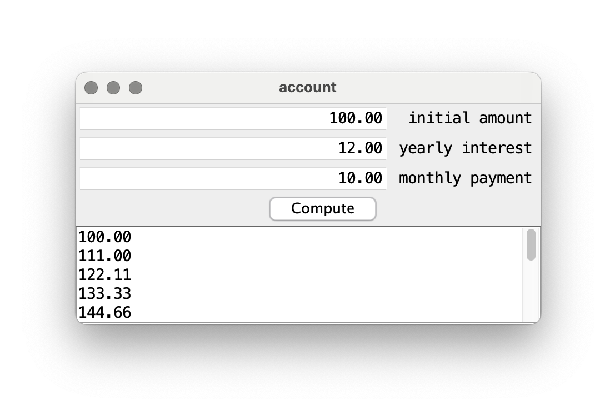

This Java program functions as a financial calculator, enabling users to enter their initial account balance, annual interest rate, and monthly payment amount through a user-friendly graphical interface (GUI). Designed for ease of use, the program allows users to input their financial information into formatted text fields seamlessly. After receiving the inputs, it processes them to convert the annual interest rate into a monthly rate, ensuring the calculations are precise and relevant to real-world financial situations.

The program's primary capability is calculating the monthly account balance over a year using the formula a * (1 + (i / 100)) + c, where a represents the current balance, i is the monthly interest rate, and c signifies the monthly payment. This calculation is executed within a loop that runs twelve times, corresponding to each month, updating the balance by accounting for accrued interest and monthly contributions. The output is formatted to two decimal places for clarity, aligning with standard financial reporting practices.

Ultimately, the monthly balances are displayed in a text area in the GUI, allowing users to monitor their account's progress over time easily. This visual representation helps users grasp the effects of regular payments and interest on their savings while fostering financial literacy by illustrating the long-term advantages of saving and investing. Overall, this project integrates programming expertise with practical financial insights, making it an invaluable resource for users aiming to manage their finances effectively.

Here is the code for computeOutput method, which uses a loop to calculate and display the monthly account balances.

private static String computeOutputs(double amount, double interest, double payment) {
    StringBuilder result = new StringBuilder();
    
    for (int month = 0; month <= 12; month++) {
        result.append(String.format("%.2f\n", amount));
        amount = amount * (1 + (interest / 100)) + payment;
    }
    
    return result.toString();
}

Example Output: 

You can learn more here at the [Financial Calculator](https://github.com/ellieishii/Financial Calculator).
