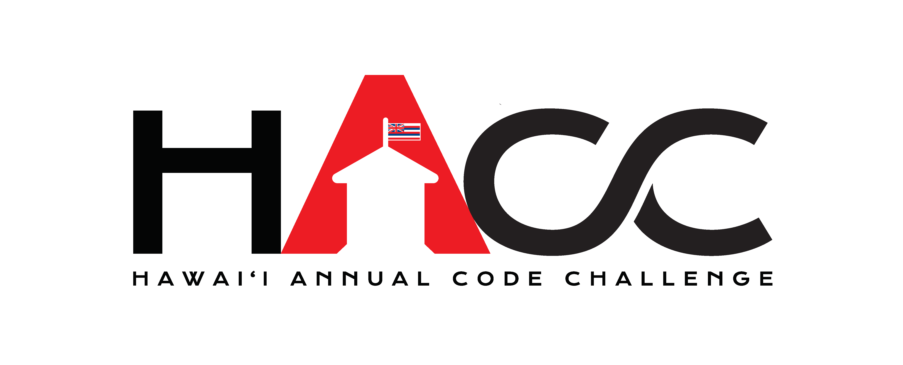

## HACC and HEX: A Journey of Innovation

[The Hawaii Annual Coding Challenge (HACC)](https://hacc.hawaii.gov/) is an annual hackathon hosted by the state of Hawaii to bring together developers, designers, and innovators to address pressing local issues through technology. The event fosters community engagement, collaboration, and innovation, enabling participants to create impactful solutions to real-world challenges. HACC serves as a platform for individuals to contribute to Hawaii’s growth by leveraging their technical skills and creativity.

As part of HACC 2024, our team, [Hex / Haumana Exchange](https://www.haumanaexchange.org/), developed the [UHSpace Data Hub](https://uhspace.org/) website, a modernized and enhanced version of the Hawaii government’s open data website. The original website, [Hawaii Open Data](https://opendata.hawaii.gov/), was functional but lacked interactivity and user-friendly features. Our mission was to create a platform that makes uploading, analyzing, and visualizing open data seamless and engaging while adding advanced tools for enhanced usability.

## Revolutionizing Open Data: Our Vision in Action

Our solution, UHSpace Data Hub, introduces several innovative features designed to transform the user experience:

- ##### Upload, Analyze, and Visualize Data:
  Users can upload CSV files, which are then automatically processed to generate clear and interactive visualizations, such as graphs and charts. This makes data analysis more accessible and intuitive.
- ##### Automated Insights and Interactive Filters:
  The platform provides dataset-specific guidance and insights powered by AI. Users can filter data interactively to focus on specific aspects, allowing for deeper analysis.
- ##### Custom Visualization Exports:
  Users can customize their visualizations and export them for presentations, reports, or further use.
- ##### AI Chatbot Assistance:
  The integrated chatbot offers precise guidance based on the datasets, assisting users in navigating the platform, interpreting data, and crafting reports.
- ##### Project Showcase:
  A dedicated page allows users to upload and share their projects, including embedding PDFs. This feature provides inspiration and fosters collaboration among community members.
- ##### InstaNote for Reporting:
  This feature lets users write and submit reports directly on the platform. Once completed, reports are automatically displayed on the project page, streamlining the documentation
  process.

The UHSpace Data Hub website was developed using modern technologies like Next.js, React, and Bootstrap 5. These tools ensure that the platform is responsive, visually appealing, and accessible across various devices, offering a significant improvement over the original government website.

## Designing Impact: My Role in HEX

In this project, I was responsible for the user interface (UI), focusing on creating a visually engaging and intuitive experience. I redesigned the platform’s layout to be both eye-catching and user-friendly, employing modern UI practices to deliver a consistent and enjoyable experience. Interactive features were integrated to make the platform more dynamic and engaging. Through this process, I realized the importance of the user interface: no matter how functional a website is, if it isn’t eye-catching and user-friendly, users won’t stay long enough to experience its full capabilities. This insight guided my design decisions, ensuring the platform was not only functional but also inviting and easy to navigate.

## Enhancing Hawaii’s Open Data Experience

The redesigned UHSpace Data Hub platform has significantly improved access to Hawaii’s open data, making it actionable and engaging for individuals, organizations, and policymakers. By integrating advanced tools and creating a collaborative environment, HEX addresses community needs effectively while fostering innovation. In conclusion, UHSpace Data Hub reflects the spirit of HACC by merging innovation with community service. Through our efforts, we placed second in the competition, showcasing the impact of our work. Our website demonstrates how user-focused design and advanced technology can create meaningful change, setting a new standard for open data platforms in Hawaii.

 

You can learn more here at the [HEX Repository](https://github.com/HACC2024/HEX).
