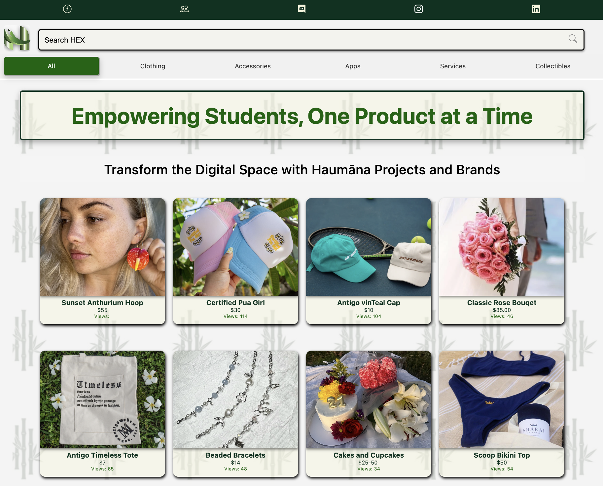

 

## Empowering Student Entrepreneurs at UH Manoa

[Haumāna Exchange](https://www.haumanaexchange.org/) is a student-led platform at the University of Hawaii (UH) Manoa designed to empower student entrepreneurs by providing them with a space to showcase their businesses and services. Its mission is to bridge the gap between academic learning and real-world entrepreneurial experience, offering students the tools, resources, and community support necessary for success in today’s marketplace. The platform is fully maintained and developed by Information and Computer Sciences (ICS) students. With a focus on fostering innovation, Haumāna Exchange aims to become the #1 platform for student entrepreneurs at UH Manoa, helping them build meaningful networks and gain industry experience while continuing their academic studies.

## Driving User Experience: My Role in Haumāna Exchange

As a part of the Haumāna Exchange team, I am currently responsible for the user interface (UI) design and development. My focus is to ensure that the platform provides a visually engaging and user-friendly experience for students interacting with the site. I am working to make the website intuitive and accessible across devices, ensuring that users can easily navigate and engage with the platform.

In the coming months, I will also be stepping into the role of mobile app developer for Haumāna Exchange, where I will help extend the platform to mobile devices, enhancing accessibility and usability on smartphones and tablets. This will enable student entrepreneurs to interact with the platform more flexibly and efficiently. While my primary work involves improving the current web platform, I will continue collaborating with the team to improve UI and UX, ensuring that the platform remains fresh, modern, and user-centered.

## Gaining Hands-On Experience: What Haumāna Exchange Taught Me

Working on Haumāna Exchange has taught me valuable lessons in both web development and the intersection of technology with entrepreneurship. As a UI developer, I learned how crucial it is to balance aesthetics and functionality to create an engaging user experience. I’ve gained hands-on experience in using modern web technologies and frameworks like React and Bootstrap, which has broadened my technical skills.

Additionally, this project has given me insight into the business side of development, especially as it pertains to supporting student entrepreneurs. I’ve learned about the importance of collaboration and how technology can support business growth. This experience has also shown me the value of continuous improvement in design and functionality—how iterative changes, even small ones, can significantly enhance the user experience. As I move forward into mobile app development, I’m excited to further develop my technical skills and gain deeper insights into how mobile design can complement the platform's web experience.

## The Growing Influence of Haumāna Exchange in Student Business Development

Haumāna Exchange has had a meaningful impact on the UH Manoa community by fostering a space for student entrepreneurs to flourish. The platform not only aids students in building and promoting their ventures but also helps them gain valuable industry connections, mentorship, and real-world business experience. As I continue to contribute to the project, I see its potential to help shape the future of student-led innovation at UH Manoa and beyond.

Looking ahead, I am excited to see Haumāna Exchange grow into the leading platform for student entrepreneurs at UH Manoa, with its dynamic offerings evolving as more students get involved. By continuing to enhance the platform’s UI and eventually launching its mobile version, we will provide even more students with the opportunity to share their talents, learn from one another, and develop as both entrepreneurs and tech professionals.

## Haumāna Exchange Preview

<iframe src="https://www.haumanaexchange.org/" width="100%" height="600px" frameborder="0" title="Haumāna Exchange"></iframe>

 
