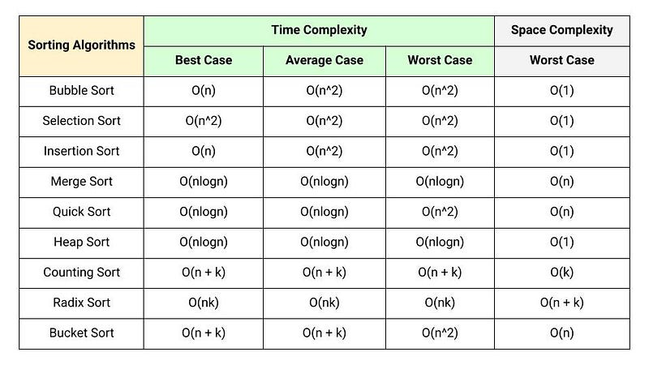

I encoded a program that sorts character arrays into alphabetical order using three different sorting algorithms: selection sort, bubble sort, and insertion sort. Additionally, it includes another function that removes the duplicates, keeping exactly one of each character in the string. This was done by using the string that was sorted by insertion sort. This program swaps during sorting, making sure that the array is arranged in ascending order. The basic outline notes to guide us were given by the professor, and it was my task to complete the program as it was for my ICS 211 course.

This program was designed to help me gain a deeper understanding of how the selection, insertion, and bubble sort algorithms work. Selection sort repeatedly selects the smallest element from the unsorted portion of the list and moves it to the sorted part. This process always takes quadratic time due to the linear time required to find the minimum element. Bubble sort compares adjacent elements and swaps them if they are out of order, continuing this process until no more swaps are needed and the entire list is sorted. While it takes linear time on a sorted array, it takes quadratic time in the worst case. Insertion sort takes the next element from the unsorted portion and inserts it into its correct position in the sorted portion of the array. It also takes linear time on a sorted array and  quadratic time in the worst case. However, insertion sort is particularly efficient when most elements are close to their correct position.

This project helped me significantly in understanding how each sorting algorithm works and how they differ from each other. Moreover, it taught me about the runtime complexity of each algorithm and how one may be a better choice depending on the situation. I also gained a better understanding of how to display only the unique values. Additionally, I learned the importance of choosing the right algorithm based on the characteristics of the data, such as how well the elements are already sorted. Analyzing both best and worst case scenarios was another valuable concept I learned, as this plays a crucial role in building optimized software.

Here is the code that only returns unique elements

static String selectUnique(char[] a) {

    insertionSort(a);

		// Removing the duplicates and only keeping the unique letters
  
		int uniqueI = 0;
  
		for (int i = 1; i < a.length; i++) {
  
			if (a[i] != a[uniqueI]) {
   
				a[++uniqueI] = a[i];
    
			}
   
		}
  

		char[] uniqueLetter = Arrays.copyOf(a, uniqueI + 1);
  

		return new String(uniqueLetter);
  
	}

You can learn more here at the [Sorting Algorithms](https://github.com/ellieishii/Sorting_Algorithms).
