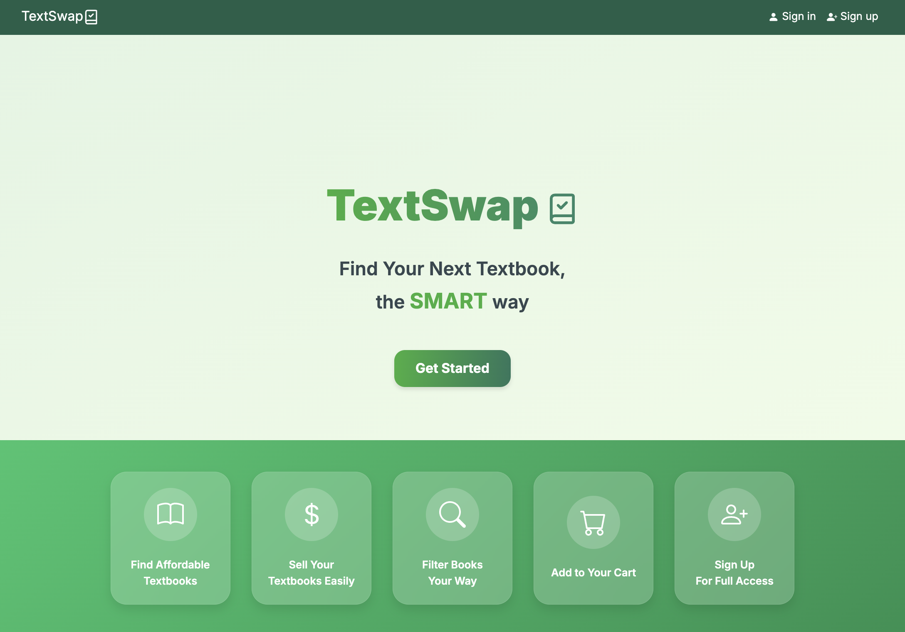

  
## Affordable Textbooks for UH Students

In the University of Hawaii community, students often face challenges in acquiring textbooks affordably and efficiently. [TextSwap](https://manoa-textswap.vercel.app/) was developed as a solution to address these challenges by providing an efficient and user-friendly platform for students to buy, sell, and trade textbooks with one another.

Our goal was to create a user-friendly, responsive, and visually appealing website that empowers students to connect and facilitate textbook exchanges seamlessly. The project utilized modern web technologies, including Next.js, React, Bootstrap 5, and GitHub Hosting, to build an interactive and intuitive platform. The result was [TextSwap](https://manoa-textswap.vercel.app/), a reliable and powerful tool designed to enhance student collaboration and reduce textbook expenses.

## Key Features and Functionality

TextSwap integrates several key features to ensure a smooth and efficient textbook exchange process:

- ##### Student Listings:
  Users can upload listings for textbooks they wish to sell or trade, including details like the book's condition, price, and course relevance.
- ##### Search and Filter Options:
  Advanced search tools enable users to find books quickly, filtering by course, author, price range, and more.
- ##### Admin Controls:
  The platform includes an admin panel where uploaded textbooks can be approved or rejected, ensuring that only relevant and appropriate listings appear on the site.
- ##### Cart Page:
  Users can easily manage their purchases through a dedicated cart page, streamlining the process of buying multiple textbooks.
- ##### Account Page:
  A personalized account page allows users to manage their profile, view their listings, and keep track of their transactions, enhancing the overall user experience.
- ##### Sign In/Sign Up:
  New users can create accounts while existing users can securely log in to access their personalized features.
- ##### Change Password:
  Users have the option to update their passwords securely, ensuring their accounts remain protected.
- ##### Responsive Design:
  Designed with mobile and desktop users in mind, the platform adapts to different screen sizes for optimal usability.

These features make TextSwap a valuable resource for the UH community, simplifying the textbook exchange process while encouraging sustainability through reuse.

## Ensuring Seamless Integration and User Experience

My primary responsibilities involved ensuring seamless functionality and integration across the platform. I managed connections with essential tools such as Vercel for deployment, Cloudinary for image storage, and pgAdmin/PostgreSQL for database management. I worked carefully to ensure all components operated flawlessly during Vercel deployment, troubleshooting and resolving issues regardless of their source. I also focused on enhancing the platform’s user experience by redesigning the landing page to make it more visually appealing and engaging. I implemented features like profile picture functionality and simplified the process of uploading images. Furthermore, I ensured the platform was fully responsive, delivering a smooth experience across all devices. In addition to these tasks, I contributed to developing critical features, including the admin page functionality and designing the payment page. I actively reviewed and tested my team members’ work, ensuring compatibility and consistent performance across the platform. This project deepened my understanding of creating user-centered designs and reinforced my belief that simplicity and functionality go hand in hand when developing effective web platforms.

## Balancing Design and Functionality

TextSwap addresses a critical need within the UH Manoa community by providing a cost-effective, accessible, and collaborative solution for textbook exchanges. The platform not only fosters sustainability through reuse but also builds a sense of connection among students by enabling peer-to-peer interactions. Reflecting on the project, I learned the importance of balancing aesthetics with functionality to ensure a platform’s usability. While technical functionality is essential, I realized that a visually appealing and user-friendly design is equally crucial to keeping users engaged and encouraging them to use the platform effectively. This project demonstrated how thoughtful design and modern technology can address real-world problems while making a meaningful impact on a specific community. I aim to apply these lessons to future projects, focusing on user-centered design, collaboration, and continuous improvement.

 

You can learn more here at the [TextSwap Repository](https://github.com/Textswap/Textswap) and [TextSwap Documentation](https://textswap.github.io/Textswap/).
