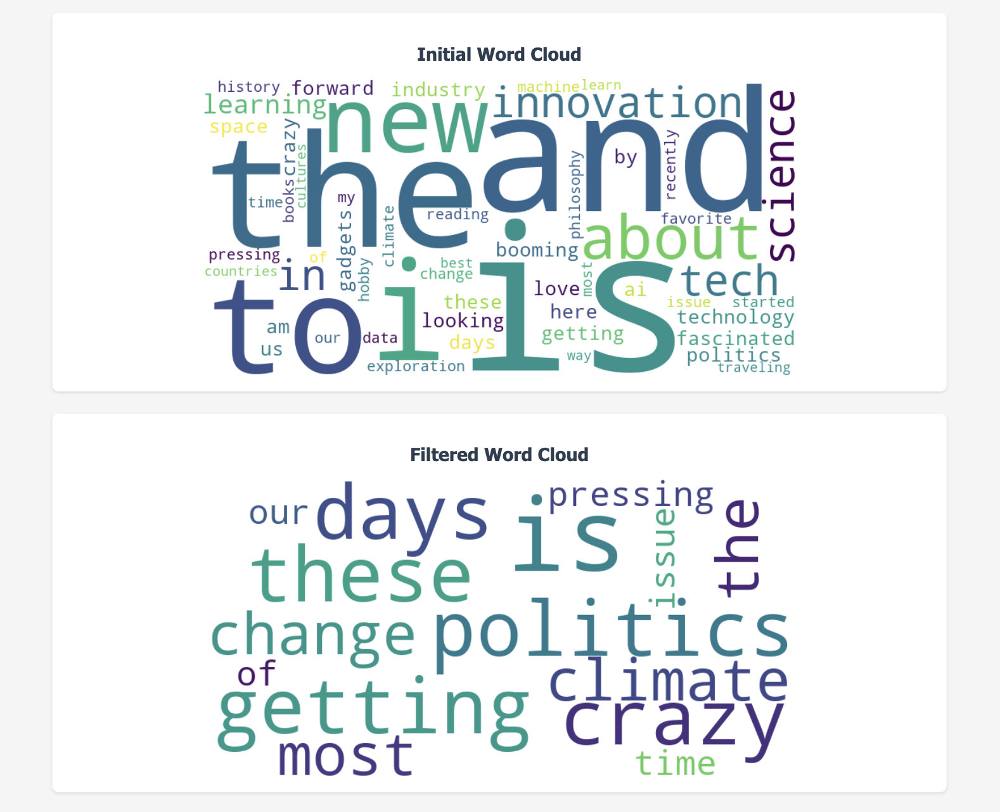
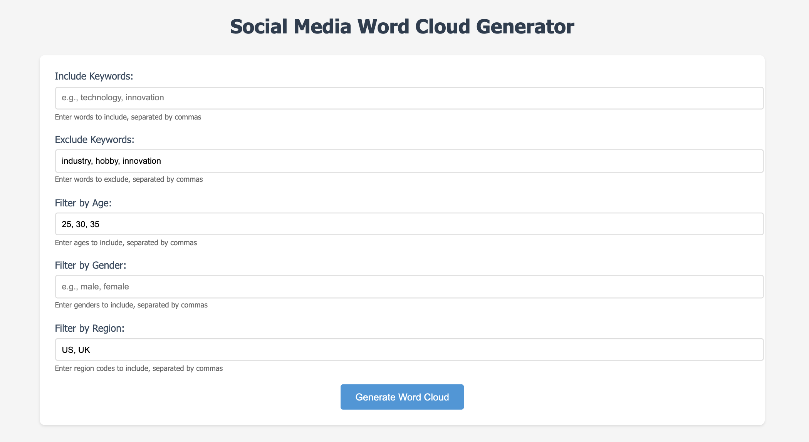

 

## Visualizing Word Frequency Trends in Social Media Posts

  

In this project, the goal was to create a dynamic word cloud visualization of the most commonly used words in social media posts, filtered by specific attributes such as keywords, age, gender, and region. The system uses Python and Flask, incorporating key libraries like WordCloud for visualization and regular expressions for text preprocessing. The data structure used to manage word frequencies is a hashmap (dictionary), which efficiently counts word occurrences. 

Additionally, the system allows users to apply filters based on post attributes, making the word cloud generation more relevant to specific criteria. The project displays two word clouds: one showing the initial word cloud with all posts and the other showing a filtered word cloud, allowing users to compare the overall word distribution versus the distribution after applying specific filters. By combining filtering, preprocessing, and efficient data structures, this solution processes text data in a scalable and interactive manner, making it suitable for handling large datasets of posts.

## Efficient Data Handling with Hashmaps and Filtering

The primary data structure for this implementation is a hashmap, or Python dictionary, which stores the frequency of each word as a key-value pair. The choice of this structure is based on its O(1) average time complexity for insertions and lookups, which makes it ideal for efficiently processing and counting words across a large volume of posts. The data is structured as a list of dictionaries, where each dictionary contains metadata about a post (e.g., post_id, user_id, age, gender, region, etc.) and the post's content. By using lists to store posts and temporary data (like filtered posts), the algorithm is able to efficiently process only relevant data.

 

The algorithm follows a structured approach with several phases:

- ##### Preprocessing:
  Converts text to lowercase and removes non-word characters
- ##### Filtering:
  Filters posts based on user-defined criteria (keywords, age, gender, and region)
- ##### Word Frequency Counting:
  Iterates through the words in each post, updating the hashmap with the word count
- ##### Visualization:
  Uses the WordCloud library to generate a word cloud image based on the word frequencies

The use of a hashmap allows for efficient updates and quick lookups, ensuring the system handles large datasets without compromising performance.

## Key Insights: Data Processing and User Interaction 

This project significantly deepened my understanding of efficient data processing, especially for real-time applications. I gained valuable insights into how data structures like hashmaps optimize performance when working with large datasets of text. The algorithm I implemented efficiently filtered, processed, and visualized text data, enabling users to interact with the word cloud based on various filters. The challenges I faced in handling user inputs and ensuring filters were applied correctly helped refine my skills in designing systems that process only relevant data, improving runtime efficiency.

Additionally, I learned the importance of clean, normalized data for ensuring consistency in word frequency counts. Preprocessing the text, such as removing non-word characters and converting everything to lowercase, played a key role in achieving accuracy. Working with Flask and integrating the WordCloud library allowed me to understand how back-end processes like text analysis can seamlessly tie into front-end visualizations, creating an engaging user experience. This project enhanced my technical skills and my ability to design scalable, efficient solutions for real-time applications.

## Optimizing Word Cloud Generation for Real-Time Applications

In conclusion, this approach of using a hashmap for word frequency counting combined with preprocessing and filtering techniques provides an efficient solution for generating dynamic word clouds from large sets of social media posts. The algorithm's O(1) operations for word frequency updates ensure that it can scale effectively even as the volume of data increases. Additionally, the use of Flask for creating the web application ensures that the solution is interactive and user-friendly, allowing for real-time filtering and visualization.

The project was a valuable learning experience, not just in terms of technical implementation but also in understanding how to design algorithms that balance speed, memory efficiency, and ease of use. By applying concepts like hashmaps, filtering, and preprocessing in a real-world application, I was able to create a solution that is both powerful and flexible, capable of handling complex tasks in social media text analysis.

 

You can learn more here at the [Repository](https://github.com/ellieishii/ICS311_Assignment6/tree/ellie-task-3).
